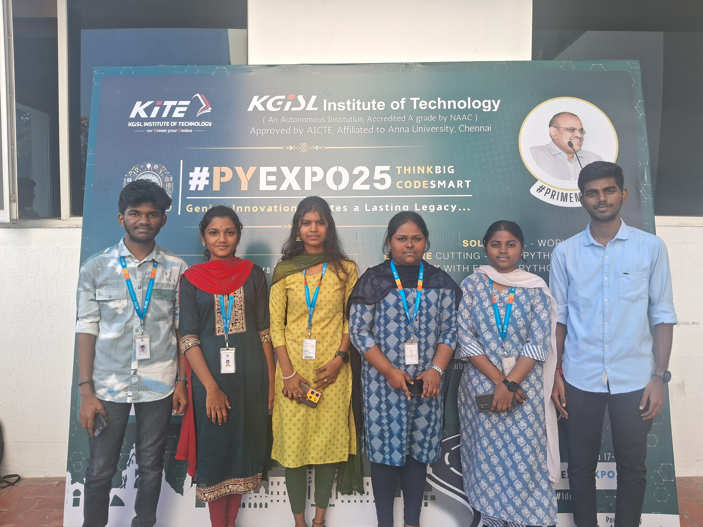

---

## Problem Statement

*Problem Statement ID – PYS118*

In india there are around 41% of people who are under privileged or from middle class can't afford facility like car incase if they want the access they use apps like red taxi the concern there is privacy because traveling with a stranger(driver) isn't advisable and In india wedding is considered to be the prestigious event of the family but in some case people can't afford wedding gown and accessories
---

## Overview

In our website  we render service or  act as a middle men where we connect the buyer and the vendor.

---

## Team Members

*Team ID – T021*

List your team members along with their roles.

- *SUNDHARAM* - Team Leader
- *SANJAY * - frontend
- *YAZHINI* - frontend
- *SOWDESWARI* - backend,database
- *HARINI SRI* - django
- *ABARNAA* - overview

---

## Technical Stack

List the technologies and tools used in the project. For example:

- *Frontend:* HTML
- *Backend:* Django
- *Database:* MySQL
- *Other Tools:* Github
---

## Getting Started

Follow these steps to clone and run the application locally.

### Prerequisites

1. Install [Python](https://www.python.org/downloads/).
2. Install [Git](https://git-scm.com/).
3. Clone this repository:
   bash
   git clone https://github.com/username/repository-name.git
   

### Installation

1. Navigate to the project directory:
   bash
   T021_DATADETECTIVES

   
2. Create a virtual environment:
   bash
   python -m venv venv
   
3. Activate the virtual environment:
   - On Windows:
     bash
     venv\Scripts\activate
     
4. Install dependencies:
   bash
   pip install -r requirements.txt
   
5. Navigate to source
   bash
   cd source
   

---

## Start the Application

1. Run the Flask application:
   bash
   flask run
   
2. In terminal: python mange.py runserver
   

---

## UI Overview

Images to demonstrate the user interface:

*Example pages:*

1. *Landing Page:*
   ![Landing Page Mockup]
      
3. *Dashboard:*
   

4. *Analytics View:*
   

---

## Resources

### 📄 PowerPoint Presentation
https://in.docworkspace.com/d/sIH6bj7qdAqLR5r0G?sa=601.1074
### 🎥 Project Video
[Click here to view the project demo video](insert-drive-link-here)

### 📹 YouTube Link
[Watch the project on YouTube](insert-youtube-link-here)

---
